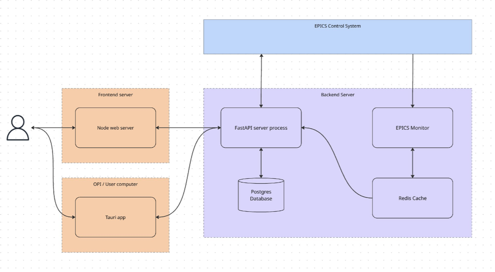

# Squirrel Backend

High-performance Python FastAPI backend for EPICS control system snapshot/restore operations, designed to handle 40-50K PVs efficiently.

## Features

- **Distributed Architecture** - Separate processes for API, PV monitoring, and background tasks
- **Fast Snapshot Creation** - Instant Redis cache reads (<5s for 40K PVs)
- **Efficient Restore Operations** - Parallel EPICS writes for quick machine state restoration
- **Real-Time Updates** - WebSocket streaming with diff-based updates and multi-instance support
- **Tag-based Organization** - Group and categorize PVs using hierarchical tags
- **Snapshot Comparison** - Compare two snapshots with tolerance-based diff
- **Persistent Job Queue** - Background tasks survive restarts with automatic retries
- **Circuit Breaker** - Fail-fast protection against unresponsive IOCs
- **PostgreSQL Storage** - Reliable relational database with async support
- **API Key Authentication** - Token-based auth with per-key read/write permissions

## Technology Stack

| Component | Technology |
|-----------|------------|
| Language | Python 3.11+ |
| Framework | FastAPI |
| Database | PostgreSQL 16+ |
| ORM | SQLAlchemy 2.0 (async) |
| Cache/Queue | Redis 7+ |
| Task Queue | Arq |
| EPICS | aioca (async Channel Access), P4P (PVAccess)|
| Migrations | Alembic |
| Validation | Pydantic v2 |

## Architecture Overview

## Quick Links

-   :material-rocket-launch:{ .lg .middle } **Getting Started**

    ---

    Get up and running in 2 minutes with Docker Compose

    [:octicons-arrow-right-24: Quick Start](getting-started/index.md)

-   :material-cog:{ .lg .middle } **Configuration**

    ---

    Environment variables and deployment options

    [:octicons-arrow-right-24: Configuration](getting-started/configuration.md)

-   :material-chart-tree:{ .lg .middle } **Architecture**

    ---

    System design and component overview

    [:octicons-arrow-right-24: Architecture](architecture/index.md)

-   :material-api:{ .lg .middle } **API Reference**

    ---

    REST endpoints and WebSocket documentation

    [:octicons-arrow-right-24: API Reference](api-reference/index.md)

-   :material-key:{ .lg .middle } **API Keys**

    ---

    Token-based authentication with read/write permissions

    [:octicons-arrow-right-24: API Keys](getting-started/api-keys.md)

## What's Running?

When you start Squirrel Backend with Docker Compose, you get:

| Service | Port | Description |
|---------|------|-------------|
| `squirrel-api` | 8080 | REST/WebSocket API server |
| `squirrel-db` | 5432 | PostgreSQL database |
| `squirrel-redis` | 6379 | Redis cache/queue |
| `squirrel-monitor` | - | EPICS PV monitoring service |
| `squirrel-worker-1/2` | - | Background job processors |

## License

MIT License - See [LICENSE](https://github.com/slaclab/react-squirrel-backend/blob/main/LICENSE.md) for details.
